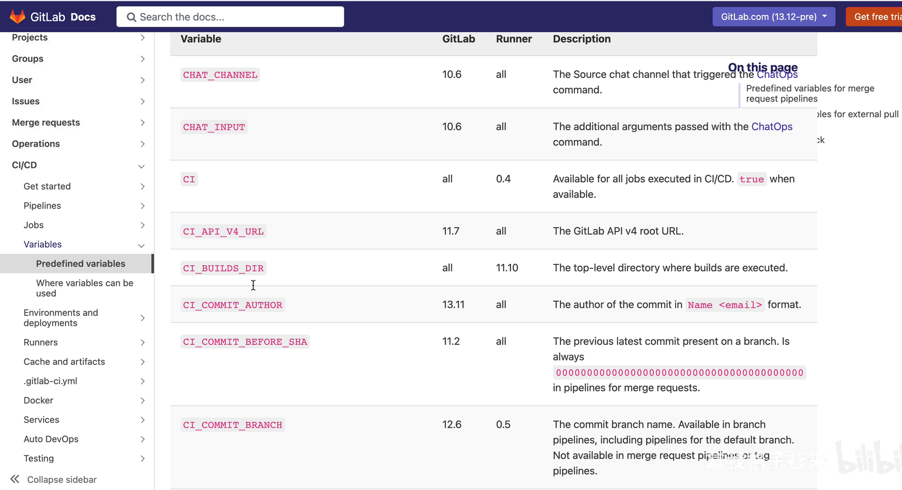
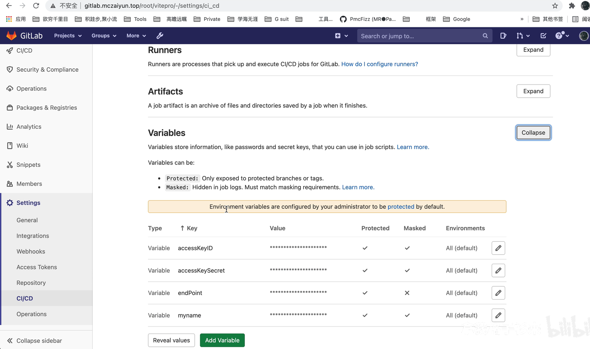

# 如何使用gitlab构建pipeline流水线

[GitLab CI/CD系列教程（七）：变量的注入与使用](https://www.bilibili.com/video/BV1gB4y1F73F/?spm_id_from=333.788&vd_source=8ba6ed28327bb7cef4adc064e3b342c1)

## gitlab ci/cd 中变量的使用

三种变量的使用
* 在.gitlab-ci.yml中自己定义
* [pipeline中预定义的变量](https://docs.gitlab.com/ee/ci/variables/predefined_variables.html)
* 设置在项目中设置变量

变量的类型
* k-v变量
* 文件

变量在哪里使用
* environment:url
* environment:name
* resource_group
* include
* variables
* image
* services:[]
* services:[]:name
* cache:key
* artifacts:name
* script, before_script, after_script
* only:variables:[], except:variables:[], rules:if


### 在.gitlab-ci.yml中自己定义
```yml
variables:
  MT_VAR: "my name is fizz"

log_var:
  script
    -echo $MT_VAR
```

```yml
job_deploy:
    variable:
        imgname: "folive"
        containername: "mylive-container"
    image: docker
    stage: deploy
    tags:
        - dockercicd
    script:
        - docker build -t $imgname .
        - if [ $(docker ps -aq --filter name=$containername) ]; then docker rm -f $containername;fi
        - docker run -d -p 8001:80 --name $containername $imgname
        - echo 'deploy docker image success, visit http://8.135.98.62.8001'
```

镜像的名称 folive
容器的名称 mylive-container

### pipeline中预定义的变量



### 设置在项目中设置变量


导出所有的预定义变量
```bash
get_all_var:
    script:
        - export
```
